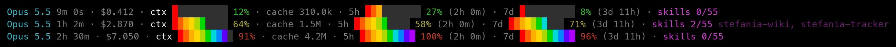

# claude-statusline-limits

Статус-строка для [Claude Code](https://claude.com/claude-code) с **тратами токенов и лимитами подписки** прямо внизу окна:



модель · длительность сессии · `$cost` · `ctx` полоской и в % · `cache` · **лимит 5 часов** полоской и в % (до сброса) · **лимит 7 дней** полоской и в % (до сброса) · `skills` (сколько скиллов сработало в сессии, если стоит плагин skill-tracker).

Полоски радужные: клетка красится по своему месту, поэтому к 100% полоска проходит всю радугу от красного до фиолетового. Цифра рядом горит зелёным до 50%, жёлтым до 80% и красным выше.

Проценты 5-часового и недельного лимитов Claude Code отдаёт **нативно** в JSON статус-строки (`rate_limits.five_hour` / `seven_day`) — скрипт их только форматирует. Никаких внешних тулов (`ccusage` и т.п.) не нужно. Блок `5h/7d` показывается только на подписочном тарифе.

## Установка

Одной командой на любой машине:

```bash
curl -fsSL https://raw.githubusercontent.com/alloben812/claude-statusline-limits/main/install.sh | bash
```

Установщик:
- пишет `~/.claude/statusline-command.sh`;
- включает блок `statusLine` в `~/.claude/settings.json` (старый `settings.json` бэкапит в `settings.json.bak.<timestamp>`, остальные ключи не трогает).

Затем **перезапусти Claude Code** — строка появится внизу.

Из клона (без обращения к сети):

```bash
git clone https://github.com/alloben812/claude-statusline-limits
bash claude-statusline-limits/install.sh
```

**Зависимости:** `bash`, `jq` (`brew install jq` / `sudo apt install jq`). Работает на macOS и Linux.

## Что показывает

| Сегмент | Источник в JSON | Примечание |
|---|---|---|
| Модель + длительность | `model.display_name`, `cost.total_duration_ms` | |
| `$cost` | `cost.total_cost_usd` | стоимость сессии |
| `ctx` | `context_window.used_percentage` | полоска + %, цифра зелёная <50, жёлтая <80, красная ≥80 |
| `cache` | `context_window.current_usage.cache_*` | сумма read+creation |
| `5h` | `rate_limits.five_hour` | полоска, % и время до сброса; только на подписке |
| `7d` | `rate_limits.seven_day` | полоска, % и время до сброса; только на подписке |
| `skills` | `session_id` + файлы `~/.claude/skill-log/` | сработало/загружено и последние три имени; без плагина skill-tracker сегмент скрыт |

### Сегмент skills

Данные для него пишет отдельный плагин `skill-tracker`: хук PostToolUse на инструменте `Skill` дописывает имя скилла в `~/.claude/skill-log/<session_id>.txt` (по строке, без повторов), а хук SessionStart кладёт число загруженных скиллов в `~/.claude/skill-log/.loaded-count`. Статус-строка только читает эти файлы. Нет файлов, нет и сегмента, так что без плагина строка работает как раньше.

## Скилл для Claude Code

В репозитории лежит скилл [`skills/statusline-limits/`](skills/statusline-limits/SKILL.md) — с ним Claude Code сам ставит, чинит и настраивает эту статус-строку по запросу («поставь статусную строку с лимитами», «статусбар не показывается»).

Подключить как пользовательский скилл (доступен во всех проектах):

```bash
git clone https://github.com/alloben812/claude-statusline-limits ~/claude-statusline-limits
ln -s ~/claude-statusline-limits/skills/statusline-limits ~/.claude/skills/statusline-limits
```

Или как проектный скилл — симлинк в `.claude/skills/` нужного проекта.

## Кастомизация

Правь `~/.claude/statusline-command.sh`:
- светлый фон терминала: `export STATUSLINE_THEME=light` (по умолчанию пустые клетки под тёмный фон);
- цвета полоски: массив `RAINBOW` (коды палитры 256; truecolor не используется, его не умеет Apple Terminal), число клеток равно длине массива;
- цвет пустых клеток: `TRACK` рядом с `RAINBOW`;
- пороги цвета цифр: числа `50` / `80` в функции `pct_col`;
- убрать/добавить сегмент: строки `seg+=(...)` в блоке *собираем сегменты*;
- формат таймеров сброса: функция `fmt_left`.

Полоска рисуется фоном клеток: символы-блоки (`█`, `▌`) Apple Terminal рисует шрифтом, и они выходят ниже строки.

Перезапуск после правки скрипта не нужен — он вызывается заново на каждом обновлении строки.

## Провенанс

Идея и раскладка — по мотивам внутреннего поста nodge (Яндекс, Этушка `post/4849970`, раздел 4).

## Лицензия

MIT — см. [LICENSE](LICENSE).
